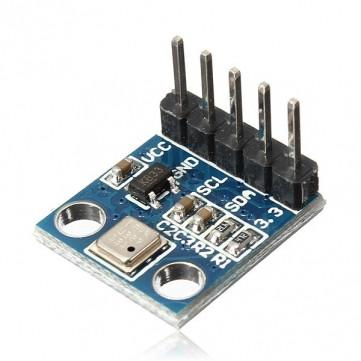
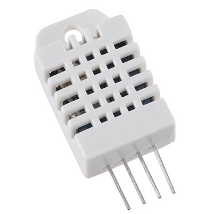
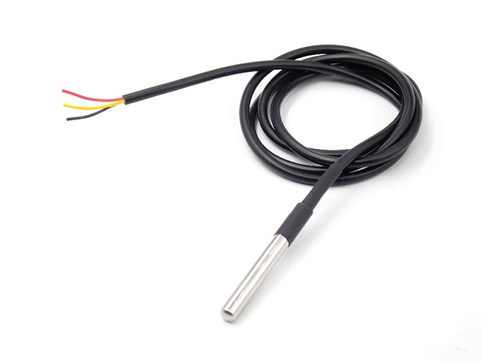
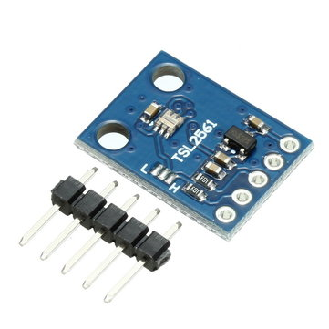

# Storm Pi
<h6>Repository for our project Storm Pi</h6>

<i>Storm Pi is our weather station which measure with 4 different sensors</i>

<h3>Sensors</h3>

<table>
  <tr>
    <th>BMP180</th>
    <th>DHT22</th>
    <th>DS18B20</th>
    <th>TSL2561</th>
  </tr>
  <tr>
    <td></td>
    <td></td>
    <td></td>
    <td></td>
  </tr>
</table>
